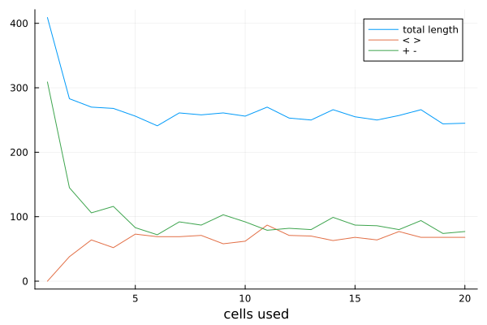
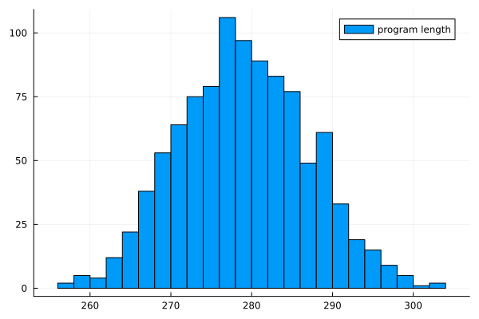

# Printing a string using an arbitrary number of cells
The idea is to have a set of cells initialized with different values, then for each byte in the string move to a cell in the set, change its value and print the byte. This creates as many different ways to print each byte as there are cells available, to optimize the program length, the shortest option is chosen. This algorithm is implemented by the fnl2bf function `print-from-memory`.

## Number of used cells
The total length of the program depends on the number of cells used and their initial values, the following Fennel program compares different amounts of used cells:

```fennel
(local bf (require :fnl2bf))

(local str
  (faccumulate [r "" i 1 100]
    (.. r (math.random 0 9))))

(for [i 1 20]
  (let [memory   []
        _        (for [i 1 i]
                   (table.insert memory (+ 48 (math.random 0 9))))
        bf       (bf.print-from-memory str memory 1 false true)
        (_ move) (string.gsub bf "[<>]" " ")
        (_ inc)  (string.gsub bf "[%+%-]" " ")]
    (print
      (..
        (length memory) ","
        (length bf)     ","
        move            ","
        inc))))
```



## Multiple shortest options
If more than one shortest option to print a byte exists, and the used option is chosen randomly from all shortest options, the total length of the program will be random, resulting in the following distribution:

```fennel
(local bf (require :fnl2bf))

(local str
  (faccumulate [r "" i 1 100]
    (.. r (math.random 0 9))))

(for [i 1 1000]
  (let [memory   [48 50 52 54 56]
        bf       (bf.print-from-memory str memory 1 true true)]
    (print (length bf))))
```


