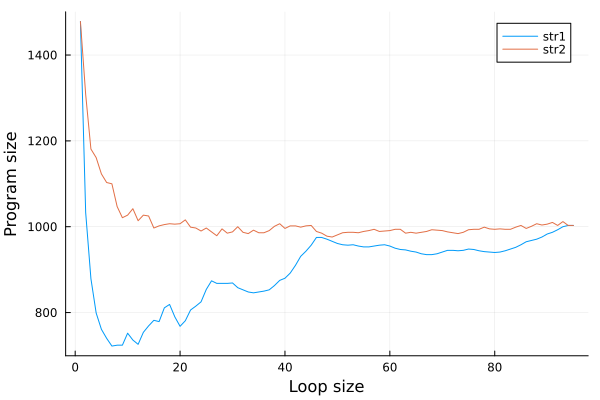

# Efficiently storing a string
To store a string in memory, it is possible to split the string into substrings and use a loop for each substring to set increment all cells for that substring.
This method is implementd by the fnl2bf function `string-opt5!`, using a lookup table generated by `../constants/inc2-n.jl`. The efficiency of this method depends on the length of the substring.

For example:
```
->--------->+[<<+>-->+++++++]-->-->++[<<->->+++++++]+>+[<-->+++++++] (up to 2 characters per loop)
```
vs
```
->--------->-->+[<<<+>-->-->+++++++]-->+>++[<<->->+++++++] (up to 3 characters per loop)
```

## Benchmarking
As the optimal loop size depends on the str, i used the following Fennel program to experiment with different loop sizes:
```fennel
(local bf (require :fnl2bf))
(local str1 "!\"#$%&'()*+,-./0123456789:;<=>?@ABCDEFGHIJKLMNOPQRSTUVWXYZ[\\]^_`abcdefghijklmnopqrstuvwxyz{|}~")
(local str2 "-j!b(x6k,IOo`AnRM+Q.2/qHa}^#3\"g81Dz%4VTPFpY:Jl|5Ge>'B$tu]&N0K7mSrLf[X9iZCyd~svE){h_<@\\w?*=WcU;")
(for [i 1 95]
  (print
    (..
      i ","
      (length (bf.optimize (bf.string-opt5! str1 1 i)))
      ","
      (length (bf.optimize (bf.string-opt5! str2 1 i))))))
```

This gives the following result when plotted, it seems like trying different loop sizes < 15 should guarantee an optimal result:



## Ideas for improvement
- Try different loop sizes within a single string
