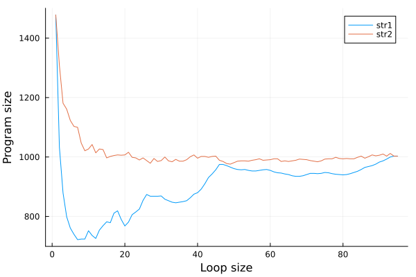
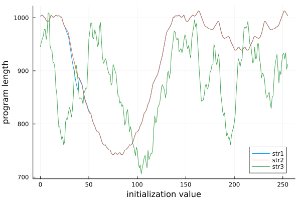

# Efficiently storing a string
## The basic approach
To store a string in memory, it is possible to split the string into substrings and use a loop for each substring to set increment all cells for that substring.
This method is implementd by the fnl2bf function `string-opt5!`, using a lookup table generated by `../constants/inc2-n.jl` (Other fnl2bf `string-*` functions use the same approach, but have a fixed smaller loop size). The efficiency of this method depends on the length of the substring = the loop size.

For example:
```
->--------->+[<<+>-->+++++++]-->-->++[<<->->+++++++]+>+[<-->+++++++] (up to 2 characters per loop)
```
vs
```
->--------->-->+[<<<+>-->-->+++++++]-->+>++[<<->->+++++++] (up to 3 characters per loop)
```

### Benchmarking
As the optimal loop size depends on the str, i used the following Fennel program to experiment with different loop sizes:
```fennel
(local bf (require :fnl2bf))
(local str1 "!\"#$%&'()*+,-./0123456789:;<=>?@ABCDEFGHIJKLMNOPQRSTUVWXYZ[\\]^_`abcdefghijklmnopqrstuvwxyz{|}~")
(local str2 "-j!b(x6k,IOo`AnRM+Q.2/qHa}^#3\"g81Dz%4VTPFpY:Jl|5Ge>'B$tu]&N0K7mSrLf[X9iZCyd~svE){h_<@\\w?*=WcU;")
(for [i 1 95]
  (print
    (..
      i ","
      (length (bf.optimize (bf.string-opt5! str1 1 i)))
      ","
      (length (bf.optimize (bf.string-opt5! str2 1 i))))))
```

This gives the following result when plotted, it seems like trying different loop sizes < 15 should guarantee an optimal result:



### Ideas for improvement
- Try different loop sizes within a single string
- Within the loop: optimize the movement using a loop
- Initialize all cells, then add the differences to the final values:
  - Initialize with a constant value, using a loop
  - Initialize with a different values, e.g. using a recurrence relation or multiple loops

## Initialize all cells with a constant value
It is possible set a large number of cells to the same value using a simple loop, e.g:
```
-[ >>[>]++[<]< - ] Add 2 to 255 cells
```
The idea is to prepare all cells of the string like this, and then only add the difference to the final value for each cell.

## Benchmarking
The following program calculates the length of the brainfuck program to store a string, without the initialization part, for each initial value form 0 to 255.
```fennel
(local bf (require :fnl2bf))

(local str1 "!\"#$%&'()*+,-./0123456789:;<=>?@ABCDEFGHIJKLMNOPQRSTUVWXYZ[\\]^_`abcdefghijklmnopqrstuvwxyz{|}~")
(local str2 "-j!b(x6k,IOo`AnRM+Q.2/qHa}^#3\"g81Dz%4VTPFpY:Jl|5Ge>'B$tu]&N0K7mSrLf[X9iZCyd~svE){h_<@\\w?*=WcU;")
(local str3 "This is a long string containining mostly lowercase characters, which means they have similar codepoints.")

(fn add-to-string [str x]
  "Add `x` to every char in `str`."
  (faccumulate [r "" i 1 (length str)]
    (.. r (string.char (% (- (string.byte str i) x) 256)))))

(for [i 0 255]
  (print
    (..
      i ","
      (length (bf.optimize (bf.string-opt5! (add-to-string str1 i) 1 (length str1)))) ","
      (length (bf.optimize (bf.string-opt5! (add-to-string str2 i) 1 (length str2)))) ","
      (length (bf.optimize (bf.string-opt5! (add-to-string str3 i) 1 (length str3)))))))
```



This data suggests that initializing the string cells with the median of the string bytes is optimal, however further testing showed that this is not always the case. In some cases where the mean and median are similar, using the mean resulted in a shorter program.
